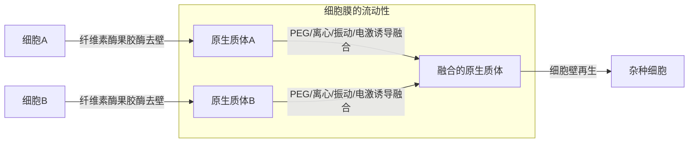
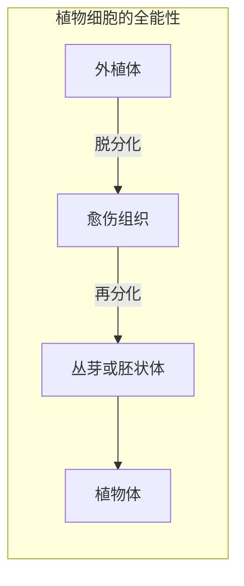

**理论基础** ：植物细胞的全能性

**技术手段** ： 植物组织培养、植物体细胞杂交

> **细胞的全能性** ：有某种生物 **全部遗传信息** 的任何一个细胞都有 **发育成完整生物体的潜能** 。
>
> 受精卵 > 生殖细胞 > 体细胞，植物细胞 一般 > 动物细胞。
>

> **植物细胞全能性的表现条件**：
>
> 离体、营养物质、植物激素(生长素、细胞分裂素)、外界条件(T、pH、hv等)适宜、无菌。

## 一、植物体细胞杂交

克服了 不同生物 **远缘杂交不亲和** 的障碍。

## 二、植物组织培养

外植体： **离体** 的植物器官、组织、细胞

愈伤组织：细胞排列疏松、无规则、高度液泡化、无定形状态。

### 培养基

- 无机：CHONP & 部分微量元素
- 有机：含N物质：维生素、氨基酸，碳源：蔗糖，生长激素：生长素、细胞分裂素

### 应用

- 培养到 **植物体** （细胞 ->  植株）

	转基因细胞 -> 转基因植物，杂种细胞 -> 杂种植物，无病毒植物分生区附近部位 -> 脱毒苗，花粉 -> 单倍体育种，愈伤组织 -> 诱变 -> 新品种

- 培养到 **丛芽或胚状体**

  人工薄膜 -> 人工种子

- 培养到 **愈伤组织**

	愈伤组织 -> 扩大培养-> 产物
